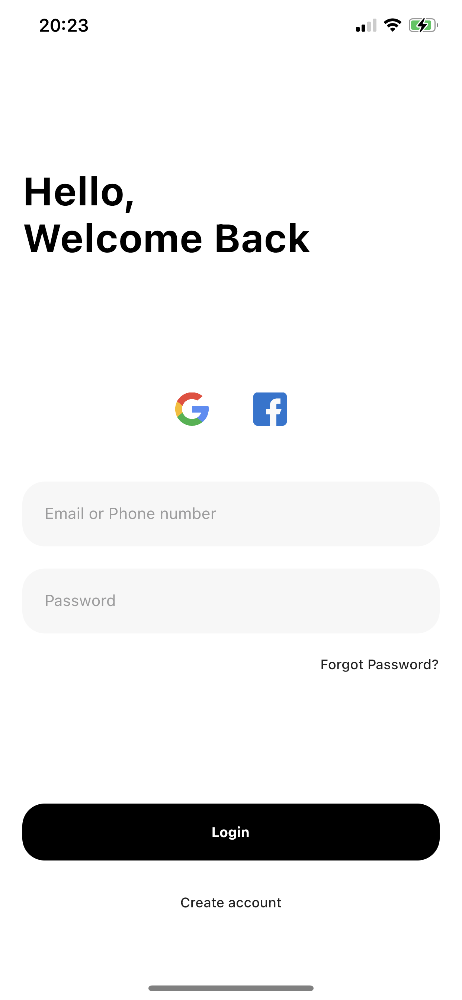
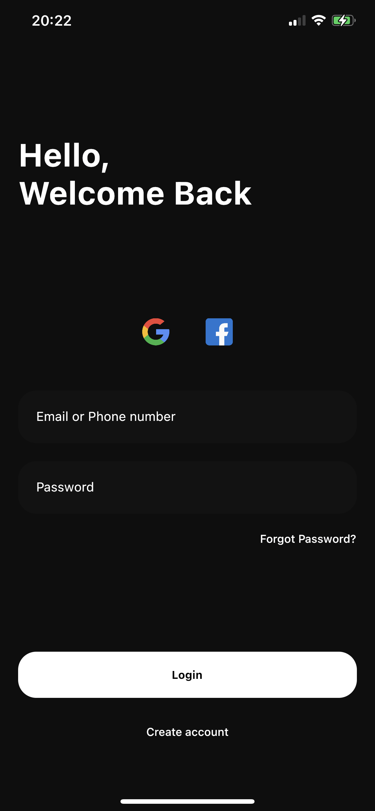

## Flutter dark and light mode Login Page UI design - day 24

A part of #flutter100daysofcode. Let's create a beautiful and animated login page UI with Flutter.

### [Watch it on Youtube](https://youtu.be/bF7-67D3x3k)

## Previous Designs
[Checkout my Youtube channel](https://youtube.com/afgprogrammer)


## Development Setup
Clone the repository and run the following commands:
```
flutter pub get
flutter run
```


## ScreenShot

&nbsp;


## Links

* [Website](https://afgprogrammer.com)
* [Youtube channel](https://youtube.com/afgprogrammer)
* [Twitter](https://twitter.com/afgprogrammer)
* [Instagram](https://instagram.com/afgprogrammer)
